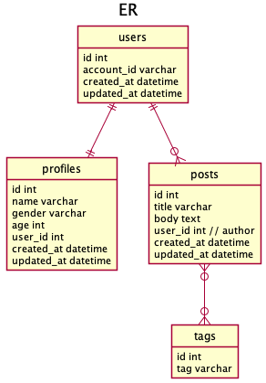
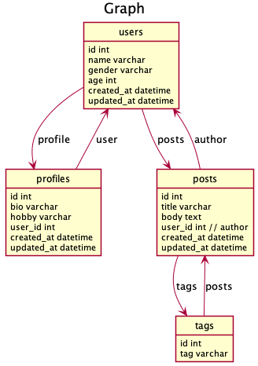

# ent-sample

## overview

[entgo.io/ent](https://github.com/ent/ent)をさわってみた。
触ってみた所感は[ブログ](https://akubi0w1.tumblr.com/post/648453540863410176/ent%E3%82%92%E8%A7%A6%E3%81%A3%E3%81%A6%E3%81%BF%E3%81%9F%E6%89%80%E6%84%9F)に書きました。

## how to start

```shell
# get ent
$ go get entgo.io/ent/cmd/ent

# generate code
$ make generate

# DBなどの環境を起動
$ make dev-up
```

## やったこと

- entのDL
- スキーマ定義
    - code generate
- edge定義

以下な感じのDBを作成した。



edgeの貼り方参考


